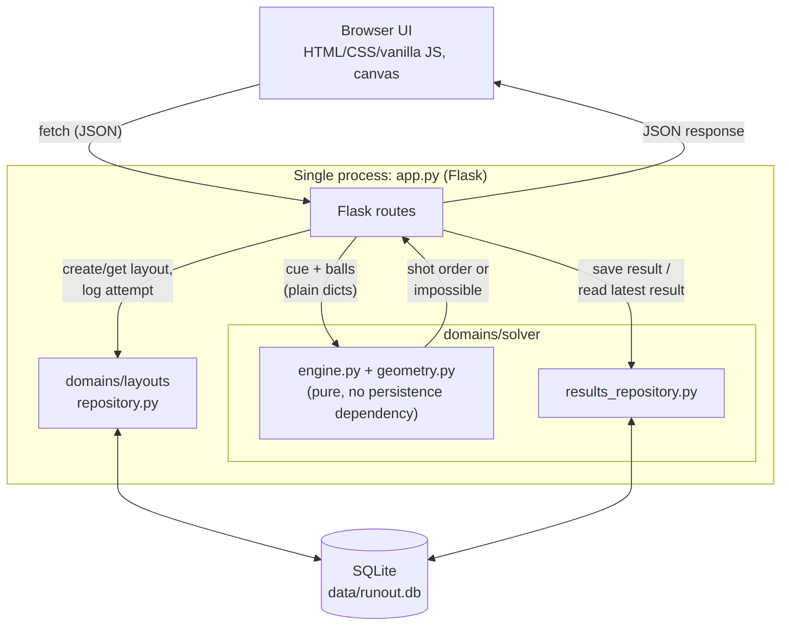
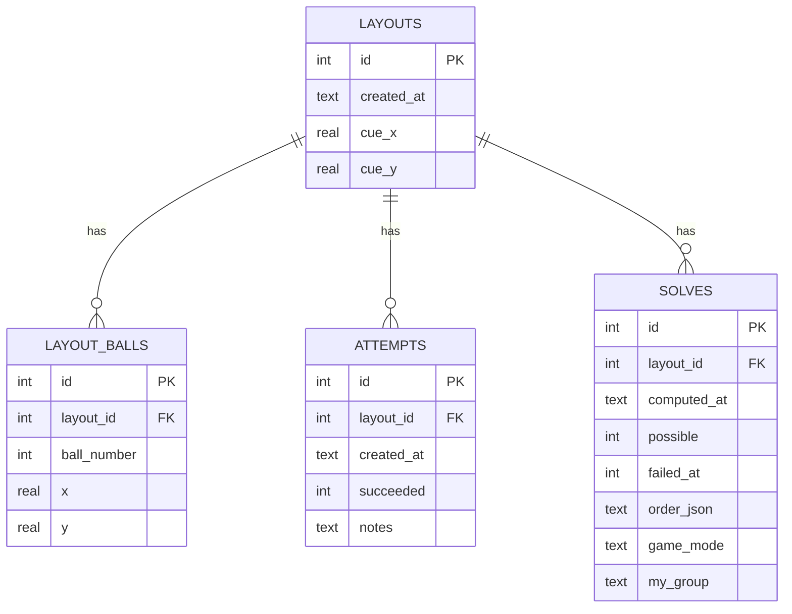

# Diagrams

Source diagrams for the report (§8). Kept as Mermaid so they render directly on GitHub and stay versioned alongside the code they describe.

## Architecture overview

Matches [ADR-2](../ADR.md): the algorithm itself (`engine.py` + `geometry.py`) never touches the database and stays unit-testable without one, but the solver domain owns a separate `results_repository.py` that saves and re-reads its own computed results — symmetric with how `domains/layouts` owns its own persistence.

## Database schema

Matches [ADR-3](../ADR.md) and the actual schema in [`db.py`](../db.py): `layout_balls`, `attempts` and `solves` are all one-to-many child tables off `layouts`, not a JSON blob.

