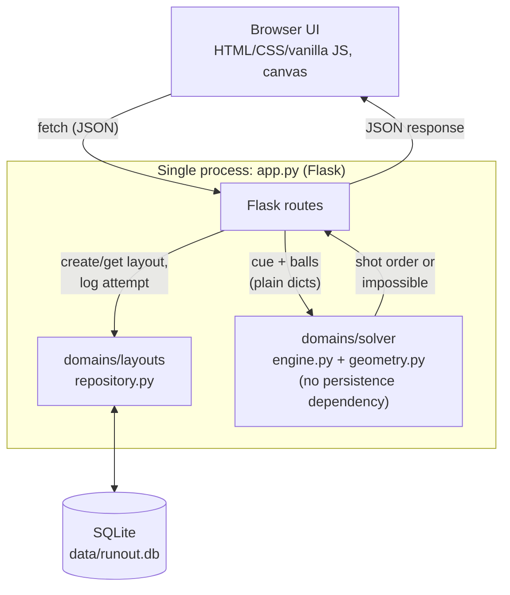
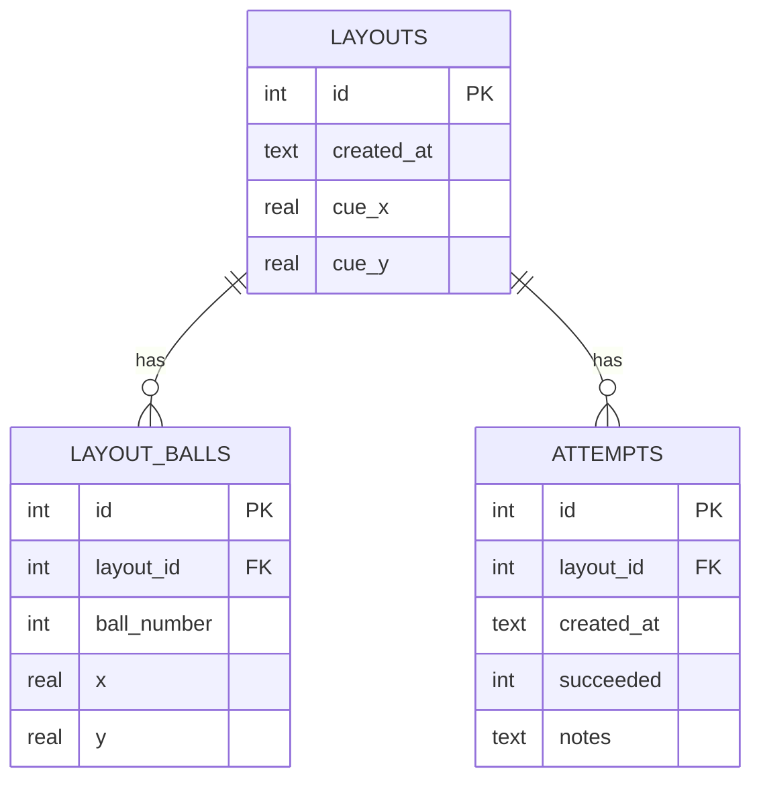

# Diagrams

Source diagrams for the report (§8). Kept as Mermaid so they render directly on GitHub and stay versioned alongside the code they describe.

## Architecture overview

Matches [ADR-2](../ADR.md): `domains/solver` never touches the database directly. `app.py` is the only place that reads a layout from `domains/layouts` and hands plain data to `domains/solver`.

## Database schema

Matches [ADR-3](../ADR.md) and the actual schema in [`db.py`](../db.py): `layout_balls` and `attempts` are both one-to-many child tables off `layouts`, not a JSON blob.

